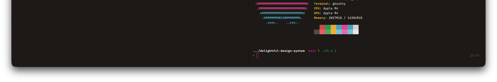

<p align="center">
  <picture>
    <source media="(prefers-color-scheme: dark)" srcset="screenshots/Starship-Dark.png" />
    <source media="(prefers-color-scheme: light)" srcset="screenshots/Starship-Light.png" />
    
  </picture>
</p>

<h1 align="center">Delightful for Shell</h1>

<p align="center">
  Terminal workspace configuration with Delightful colors -- tmux, zsh, and utilities.
</p>

---

## What's Included

### tmux.conf

Full tmux configuration with a Delightful-colored status bar.

| Feature | Details |
|---------|---------|
| Rainbow status bar | Color-block segments at the top -- pink session, gold active window, gray inactive, cyan hostname |
| Equalized splits | `prefix+\|` and `prefix+-` create panes that auto-equalize |
| Dynamic window names | Directory name when idle, process name otherwise (e.g. `claude` when Claude Code is running) |
| Dynamic tab titles | Ghostty tab bar shows session context (e.g. `1 -- myapp`) |
| Session restore | tmux-resurrect saves/restores sessions (`prefix+Ctrl+s` / `prefix+Ctrl+r`) |
| Vim-style navigation | `prefix+h/j/k/l` pane navigation, vi copy mode |
| Mouse mode | Click panes to focus, drag dividers to resize, scroll |
| Sensible defaults | 256color, no escape delay, windows start at 1, 50k scrollback |

Status bar layout:

```
 session   active   inactive   inactive          hostname   Mar 26   14:30
 (pink)    (gold)     (gray)     (gray)            (cyan)   (gray)   (dark)
```

### zshrc-snippet

Shell additions to source from your `~/.zshrc`. Each section is independent.

| Feature | Details |
|---------|---------|
| Starship prompt | Initializes the [Starship](https://starship.rs) prompt |
| Quick terminal | Auto-launches Claude Code on `Option+Space` (Ghostty 1.3+) |
| Zsh defaults | `AUTO_CD`, `CORRECT`, 50k shared history, case-insensitive completion |
| AI CLI aliases | Short aliases for Claude Code, Codex, and Gemini CLI tools |

<details>
<summary><strong>AI CLI aliases</strong></summary>

<br>

All aliases clear the visible screen (preserving scrollback) before launching.

| Alias | Command |
|-------|---------|
| `c` | `claude` |
| `cc` | `claude --dangerously-skip-permissions` |
| `ccdm` | `claude --dangerously-skip-permissions --channels plugin:imessage@claude-plugins-official --name dm` |
| `ccrc` | `claude --dangerously-skip-permissions --remote-control` |
| `cr` | `claude --resume` |
| `ccr` | `claude --dangerously-skip-permissions --resume` |
| `x` | `codex` |
| `xx` | `codex --full-auto` |
| `xr` | `codex resume` |
| `xxr` | `codex --full-auto resume` |
| `g` | `gemini` |
| `gg` | `gemini --yolo` |
| `gr` | `gemini --resume latest` |
| `ggr` | `gemini --yolo --resume latest` |

</details>

### tmux-auto-attach.sh

Ghostty command hook that gives each terminal window its own persistent tmux session. Sessions survive window closes -- reopen Ghostty and it reattaches to the first detached session. Sessions are numbered sequentially (`1`, `2`, `3`, ...) or you can pass a name to pin a window to a specific session.

Use this if you want session persistence across terminal restarts. The rest of the config works fine without it.

### smart-open

iTerm2 Semantic History handler for Cmd+click file paths. Routes clicks to the right application:

| File Type | Opens In |
|-----------|----------|
| Code files (40+ extensions) | VS Code (with `--goto` line numbers) |
| Extensionless code files | VS Code (Dockerfile, Makefile, etc.) |
| `.html` / `.htm` | Chrome |
| Images, PDFs | Preview |
| Directories | Finder |
| Everything else | Default app |

## Prerequisites

**Nerd Font** -- recommended if you also use [delightful-starship](https://github.com/kylesnav/delightful-starship), which renders powerline glyphs. The tmux status bar itself uses plain color blocks and works with any font.

```sh
brew install --cask font-jetbrains-mono-nerd-font
```

**Suppress "Last login"** -- stop macOS from printing `Last login: ...` on every new terminal:

```sh
touch ~/.hushlogin
```

## Install

Pick what you need -- each file is independent.

### tmux

```bash
git clone https://github.com/kylesnav/delightful-shell.git
cp delightful-shell/tmux.conf ~/.tmux.conf
```

Install [TPM](https://github.com/tmux-plugins/tpm) (Tmux Plugin Manager), then press `prefix + I` inside tmux:

```bash
git clone https://github.com/tmux-plugins/tpm ~/.tmux/plugins/tpm
```

### Zsh

Source the snippet in your `~/.zshrc`:

```bash
# Option A: source directly from the cloned repo
source /path/to/delightful-shell/zshrc-snippet

# Option B: copy to your dotfiles
cp delightful-shell/zshrc-snippet ~/.config/zsh/delightful.zsh
source ~/.config/zsh/delightful.zsh
```

### tmux-auto-attach (optional)

```bash
mkdir -p ~/.local/bin
cp delightful-shell/tmux-auto-attach.sh ~/.local/bin/tmux-auto-attach
chmod +x ~/.local/bin/tmux-auto-attach
```

In your Ghostty config:

```
command = /Users/YOU/.local/bin/tmux-auto-attach
```

Pass a name to pin a window to a specific session: `command = /path/to/tmux-auto-attach work`.

### smart-open (iTerm2 only)

```bash
mkdir -p ~/.local/bin
cp delightful-shell/smart-open ~/.local/bin/smart-open
chmod +x ~/.local/bin/smart-open
```

In iTerm2: **Settings > Profiles > Advanced > Semantic History > Run command...**

```
"/Users/YOU/.local/bin/smart-open" "\1" "\2" "\5"
```

## Terminal Compatibility

| Feature | Ghostty | iTerm2 | Other |
|---------|---------|--------|-------|
| tmux config | Yes | Optional\* | Any tmux-capable terminal |
| tmux auto-attach | Yes | No | No |
| Zsh config | Yes | Yes | Any zsh shell |
| Quick terminal | Yes (1.3+) | No | No |
| AI CLI aliases | Yes | Yes | Any terminal |
| smart-open | No | Yes | No |

\* iTerm2 users may prefer native tmux integration (`tmux -CC`).

## Part of Delightful

This config is part of the [Delightful Design System](https://github.com/kylesnav/delightful-design-system) -- a warm, neo-brutalist design system built on OKLCH color science.

Other terminal ports:

- [delightful-ghostty](https://github.com/kylesnav/delightful-ghostty) -- Ghostty terminal themes
- [delightful-starship](https://github.com/kylesnav/delightful-starship) -- Starship prompt theme
- [delightful-iterm2](https://github.com/kylesnav/delightful-iterm2) -- iTerm2 color profiles

## License

[MIT](LICENSE)
